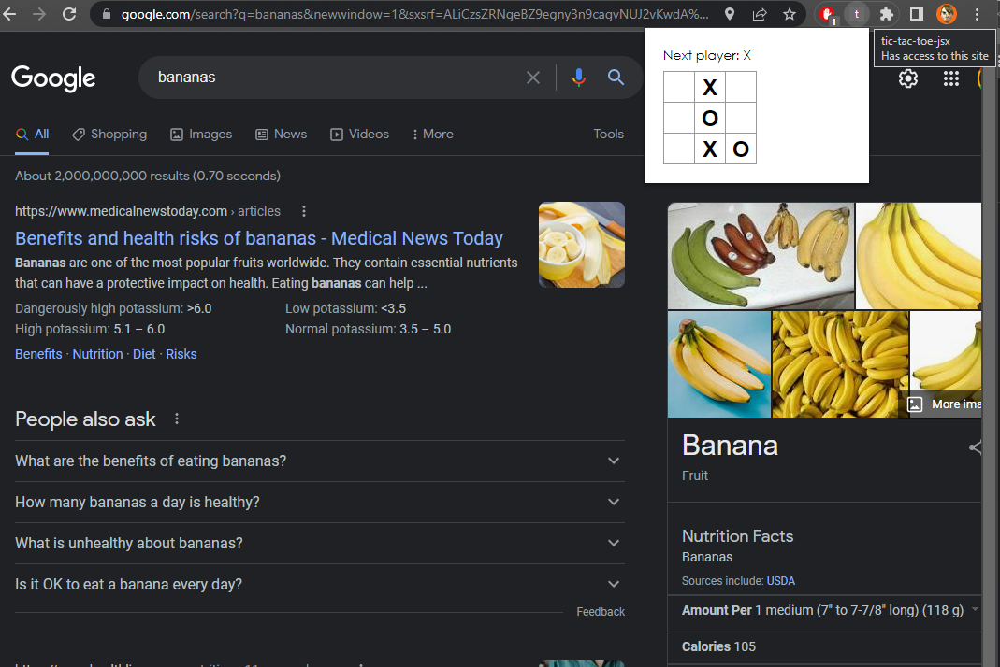

# `react-tic-tac-toe-jsx-app`

[](https://github.com/percebus/react-tic-tac-toe-jsx-app/actions/workflows/verify.yml)

[](https://github.com/percebus/react-tic-tac-toe-jsx-app/actions/workflows/pull_request.yml)


## History

Followed the ["Tutorial: Intro to React"](https://reactjs.org/tutorial/tutorial.html) tutorial to make this application

See [HISTORY](./HISTORY.md)

## 'To-Do's

See [TODO](./TODO.md)s

## Setup

### First time

```bash
$> npm run setup
```

It mainly installs global dependencies

### Dependencies

```bash
$> npm install
```

## R&D

### Test

`FIXME` not working

```bash
$> npm test
```

### Build

#### `build/`

[](https://github.com/percebus/react-tic-tac-toe-jsx-app/actions/workflows/verify.yml)

```bash
$> npm run build
```

#### `out/`

```bash
$> npm run out
```

### Run

```bash
$> npm start
```

This will host the app in http://localhost:3000

## `electron`

### Run

```bash
$> npm run electron
```

### `forge`

#### Package

```bash
$> npm run electron:forge:package
```

#### Make

```bash
$> npm run electron:forge:make
```

### OS

#### Windows


#### Run

```bash
$> npm run electron:forge:start
```

## `chrome-extension`

Simply Load the generated `build/` folder from either `chrome` or `edge` `extensions`

### `manifest.json`

We were able to make this application a browser extension by simply including a `manifest.json` file inside `public/` folder.

### `chrome/background/service_worker.js`

This file also gets included from `public/` folder as a static file, and its meant to be vanilla JS that gets executed as a background service.

Ideally, we would also compile this as any other modern application.

See [TODO](./TODO.md)s for more information

### Browsers

#### `chrome`


